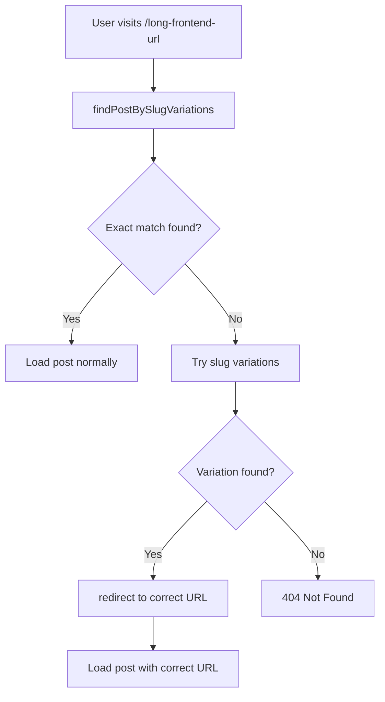

# Automatic URL Mapping & Redirect System

## 🎯 Overview

This system automatically handles URL mapping between frontend and WordPress backend, ensuring seamless user experience even when URL structures differ between systems.

## ✅ Features

### 1. **Automatic URL Resolution**
- Resolves WordPress backend URLs for Rank Math API calls
- Maintains frontend URLs for canonical tags and social sharing
- Dynamic environment-based URL construction

### 2. **Smart Slug Variations**
- Automatically tries different slug patterns when exact match fails
- Removes common Indonesian suffixes (`-menggunakan-bash`, `-terbaru`, etc.)
- Tests shortened versions (first 4-6 words)
- Server-side redirects to correct URLs

### 3. **Environment-Based Configuration**
- Configurable WordPress backend URL via environment variables
- Automatic fallback to hardcoded URLs if environment not set
- Support for different domains (development, staging, production)

## 🔧 Implementation

### Core Components

#### 1. URL Resolver (`src/lib/url-resolver.ts`)
```typescript
// Resolves WordPress backend URL for Rank Math API
resolveRankMathUrl(post: { link?: string; slug: string }): string

// Resolves frontend URL for canonical and social sharing
resolveFrontendUrl(slug: string): string

// Finds posts by trying slug variations
findPostBySlugVariations(frontendSlug: string)

// Checks if redirect is needed
checkForRedirect(frontendSlug: string): Promise<string | null>
```

#### 2. Environment Configuration (`src/config/environment.ts`)
```typescript
wordpress: {
  backendUrl: process.env.WORDPRESS_BACKEND_URL || 'fallback-url'
}
```

#### 3. Page Integration (`src/app/[slug]/page.tsx`)
```typescript
// Automatic redirect if different slug found
const postResult = await findPostBySlugVariations(resolvedParams.slug);
if (postResult.redirectSlug && postResult.redirectSlug !== resolvedParams.slug) {
  redirect(`/${postResult.redirectSlug}`);
}
```

## 🚀 Configuration

### Environment Variables

Add to your `.env.local`:

```bash
# WordPress Backend URL (for Rank Math and redirects)
WORDPRESS_BACKEND_URL=https://backend.indexof.id

# Rank Math API Configuration
NEXT_PUBLIC_RANKMATH_API_ENABLED=true
NEXT_PUBLIC_RANKMATH_API_URL=https://backend.indexof.id/wp-json/rankmath/v1/getHead
```

### Automatic URL Patterns

The system handles these URL variations:

| Frontend URL Pattern | Backend URL Pattern | Status |
|---------------------|-------------------|---------|
| `cara-import-database-mysql-mariadb-menggunakan-bash` | `cara-import-database-mysql-mariadb` | ✅ Auto-redirect |
| `setup-vps-ubuntu-paling-cepat` | `setup-vps-ubuntu` | ✅ Auto-redirect |
| `tutorial-wordpress-lengkap-terbaru` | `tutorial-wordpress` | ✅ Auto-redirect |

## 📊 How It Works

### 1. **URL Request Flow**


### 2. **Slug Variation Logic**
```javascript
const variations = [
  // Remove common suffixes
  slug.replace('-menggunakan-bash', ''),
  slug.replace('-paling-cepat', ''),
  slug.replace('-terbaru', ''),
  slug.replace('-lengkap', ''),
  
  // Try shorter versions
  slug.split('-').slice(0, 4).join('-'), // First 4 words
  slug.split('-').slice(0, 5).join('-'), // First 5 words
  slug.split('-').slice(0, 6).join('-'), // First 6 words
];
```

### 3. **URL Mapping Priority**
1. **post.link** from WordPress API (highest priority)
2. **Environment config** + slug construction
3. **Hardcoded fallback** URLs

## 🎯 Use Cases

### Case 1: WordPress URL Change
**Problem**: WordPress admin changes post slug from `cara-import-database-mysql-mariadb-menggunakan-bash` to `cara-import-database-mysql-mariadb`

**Solution**: 
1. User visits old URL
2. System tries exact match → fails
3. System tries variations → finds new slug
4. User redirected to new URL automatically
5. SEO preserved, no broken links

### Case 2: Domain Migration
**Problem**: Moving from `old-domain.com` to `new-domain.com`

**Solution**:
1. Update `WORDPRESS_BACKEND_URL` environment variable
2. All Rank Math API calls automatically use new domain
3. No code changes required

### Case 3: Development vs Production
**Problem**: Different URL structures between environments

**Solution**:
```bash
# Development
WORDPRESS_BACKEND_URL=http://localhost:8080

# Staging  
WORDPRESS_BACKEND_URL=https://staging-backend.domain.com

# Production
WORDPRESS_BACKEND_URL=https://backend.domain.com
```

## 🔍 Debugging

### Enable Debug Logging
Check development server console for logs like:
```
[findPostBySlugVariations] Searching for slug: long-frontend-url
[findPostBySlugVariations] No exact match, trying variations...
[findPostBySlugVariations] Trying variations: [short-url, ...]
[findPostBySlugVariations] Found match with variation: short-url -> redirecting
```

### Test URL Mapping
```bash
# Test if automatic redirect works
curl -L "http://localhost:3000/long-frontend-url"

# Should redirect to correct URL with 200 status
curl -L "http://localhost:3000/correct-backend-url"
```

## 🛡️ Error Handling

### Graceful Degradation
1. **API Fails**: Falls back to manual schema generation
2. **No Variations Found**: Shows 404 with proper error page
3. **Redirect Loops**: Max 1 redirect prevents infinite loops
4. **Environment Missing**: Uses hardcoded fallback URLs

### Performance Optimization
- **Caching**: WordPress API responses cached for 1 hour
- **Parallel Requests**: Categories, tags, and posts fetched simultaneously
- **Smart Variations**: Only tries relevant patterns, not brute force
- **Early Exit**: Stops searching after first match found

## 📈 Benefits

### For Users
- ✅ No broken links when WordPress URLs change
- ✅ Fast automatic redirects to correct content
- ✅ SEO-friendly 301 redirects preserve rankings

### For Developers  
- ✅ Environment-based configuration
- ✅ Zero manual URL mapping maintenance
- ✅ WordPress admin can change URLs freely
- ✅ Debug logging for troubleshooting

### For SEO
- ✅ Proper canonical URLs maintained
- ✅ Rank Math SEO data always synced
- ✅ No duplicate content issues
- ✅ Link equity preserved through redirects

## 🚨 Important Notes

1. **Server-Side Only**: Redirects happen on server, not client
2. **Single Redirect**: Each request max 1 redirect to prevent loops  
3. **Priority Order**: WordPress API link > Environment config > Fallback
4. **Case Sensitive**: Slug matching respects WordPress slug format
5. **Performance**: Variation testing adds ~100-200ms per miss

## 🔮 Future Enhancements

- [ ] **Custom Redirect Rules**: Admin-defined URL mapping
- [ ] **Analytics Integration**: Track redirect patterns
- [ ] **Machine Learning**: Smart pattern detection
- [ ] **Batch Processing**: Pre-generate URL mappings
- [ ] **API Endpoint**: External URL resolution service

---

**Last Updated**: January 2025  
**Status**: ✅ Production Ready 